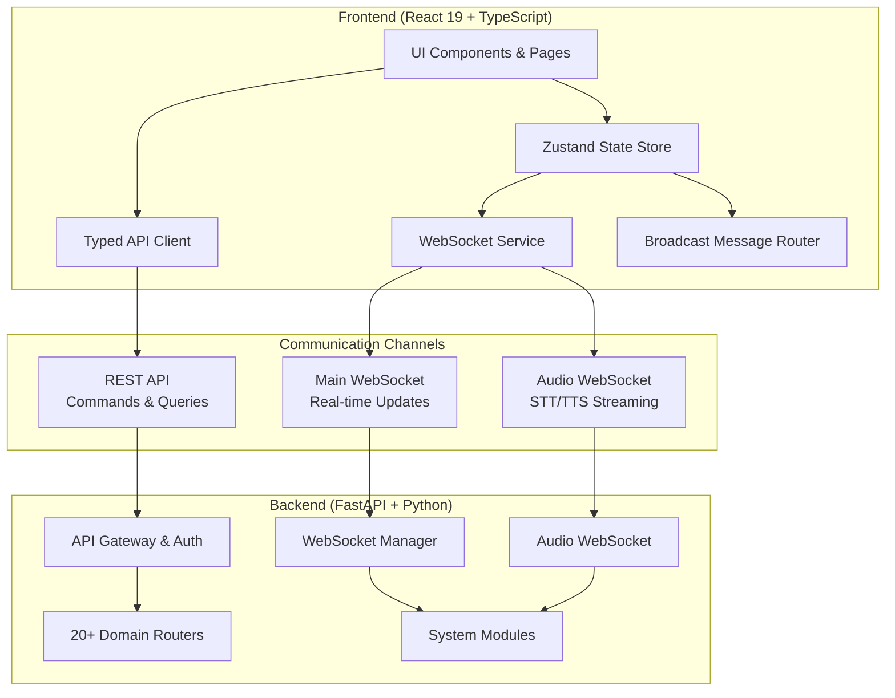
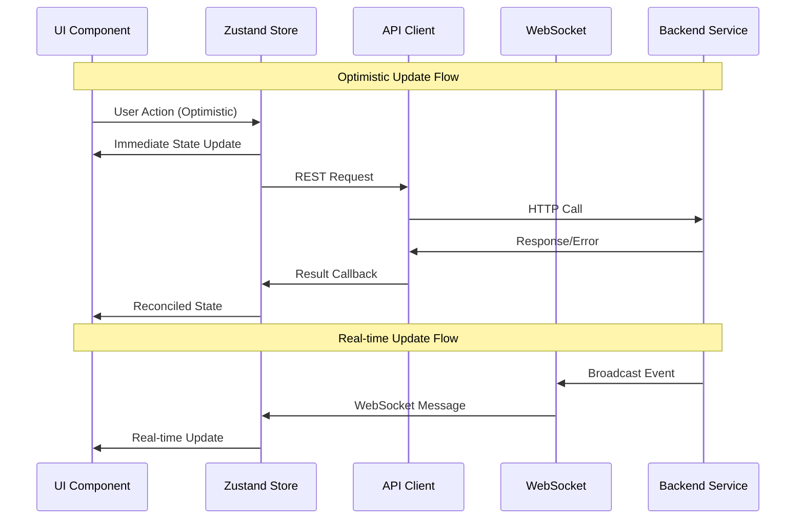

# Design Document: Complete JARVIS Frontend-Backend Integration

## Overview

This design document outlines the comprehensive technical architecture for connecting the complete JARVIS frontend to the backend systems. JARVIS is a sophisticated bilingual AI assistant with extensive capabilities spanning system control, automation, media processing, and real-time communication. The integration ensures seamless, high-performance connectivity between the React 19 frontend and the FastAPI backend through multiple communication channels.

The architecture addresses all 10 requirement areas with a focus on:

- **Complete API Coverage**: Systematic validation and integration of 100+ endpoints across 20+ backend router modules
- **Real-Time Synchronization**: WebSocket-based bidirectional communication with sub-100ms latency
- **State Management**: Zustand-powered reactive state with optimistic updates and rollback capabilities  
- **Error Resilience**: Comprehensive error handling with exponential backoff, graceful degradation, and user-friendly messaging
- **Performance Optimization**: Virtual scrolling, request debouncing, and lazy loading for responsive interactions
- **Security**: Constant-time API key validation, secure WebSocket authentication, and structured error logging

### Key Design Decisions

1. **Dual Communication Pattern**: REST API for commands/queries with WebSocket overlay for real-time updates
2. **Reactive State Architecture**: Zustand stores with domain slices responding to both user actions and WebSocket events
3. **Resilient Connection Management**: Auto-reconnecting WebSocket with exponential backoff (1s to 30s) and health monitoring
4. **Optimistic UI Updates**: Immediate UI feedback with server reconciliation and rollback on conflicts
5. **Component-Based Integration**: Each UI page directly integrates with corresponding backend router domains

## Architecture

### High-Level System Architecture



### Communication Flow Architecture

The system employs a sophisticated three-channel communication strategy:

1. **REST API Channel**: Primary request-response communication for commands, queries, and data operations
2. **Main WebSocket**: Real-time system updates, status broadcasts, and bidirectional messaging  
3. **Audio WebSocket**: Specialized high-throughput channel for voice processing with STT/TTS streaming

### State Synchronization Architecture



## Components and Interfaces

### Core Frontend Services

#### API Client Service (`apiClient.ts`)

The API client provides fully typed access to all backend endpoints with comprehensive error handling:

**Key Features:**
- **Complete Coverage**: 100+ typed methods covering all backend router domains
- **Error Resilience**: Retry logic with exponential backoff for 429 rate limits  
- **Request Deduplication**: Automatic request debouncing for high-frequency calls
- **Authentication**: Automatic API key injection and error handling
- **Type Safety**: Full TypeScript definitions for all request/response payloads

**Interface Design:**
```typescript
interface ApiClient {
  // System Control
  getSystemStatus(): Promise<SystemStatus>
  executeCommand(command: string, language?: string): Promise<CommandResult>
  
  // File Operations
  listFiles(folder: string, pattern?: string): Promise<FileListResponse>
  searchFiles(query: string, folder?: string): Promise<FileListResponse>
  
  // Real-time Features
  takeScreenshot(save?: boolean): Promise<ScreenshotResponse>
  ocrScreen(language?: string): Promise<OCRResultResponse>
  
  // Error Handling
  safeRequest<T>(fn: () => Promise<T>): Promise<T | null>
}
```

#### WebSocket Service (`websocketService.ts`)

Manages persistent WebSocket connections with advanced reconnection logic:

**Key Features:**
- **Auto-Reconnect**: Exponential backoff reconnection (1s to 30s max, 10 attempts)
- **Health Monitoring**: Ping/pong keepalive with 30s intervals and 10s timeout
- **Connection States**: Typed connection state management (`connected` | `connecting` | `disconnected`)
- **Authentication**: Query parameter API key authentication for browser compatibility
- **Message Routing**: Integration with broadcast router for message distribution

**Connection Management:**
```typescript
class WebSocketService {
  connectionState: 'connected' | 'connecting' | 'disconnected'
  
  connect(): void
  disconnect(): void
  send(message: WSOutboundMessage): void
  onStateChange(listener: ConnectionStateListener): UnsubscribeFn
  
  private scheduleReconnect(): void // Exponential backoff
  private startPingInterval(): void // Health monitoring
}
```

#### Broadcast Router (`broadcastRouter.ts`)

Routes incoming WebSocket messages to appropriate handlers based on message type:

**Message Routing System:**
```typescript
interface BroadcastRouter {
  on(type: string, handler: BroadcastHandler): void
  off(type: string, handler: BroadcastHandler): void
  route(message: WebSocketMessage): void
}

// Usage in stores
broadcastRouter.on('system_status', (message) => {
  systemStore.updateStatus(message.data)
})

broadcastRouter.on('command_result', (message) => {
  commandStore.addResult(message.data)
})
```

### State Management Architecture

#### Zustand Store Design

The state management employs domain-specific slices with cross-cutting concerns:

**Store Structure:**
```typescript
interface StoreState extends 
  SystemState,
  CommandState, 
  ConnectionState,
  FileState,
  AutomationState,
  WhatsAppState {
    
  // Cross-cutting actions
  handleWebSocketMessage(message: WebSocketMessage): void
  handleApiError(error: ApiError): void
  performOptimisticUpdate<T>(action: OptimisticAction<T>): void
}
```

**System State Slice:**
```typescript
interface SystemState {
  status: SystemStatus | null
  performance: PerformanceMetrics[]
  realTimeUpdates: boolean
  
  // Actions
  updateSystemStatus(status: SystemStatus): void
  addPerformanceMetric(metric: PerformanceMetrics): void
  toggleRealTimeUpdates(): void
}
```

**Command State Slice:**
```typescript
interface CommandState {
  history: CommandHistoryEntry[]
  currentMode: AppMode
  pendingCommands: PendingCommand[]
  suggestions: CommandSuggestion[]
  
  // Optimistic updates
  addCommandOptimistic(command: string): void
  confirmCommand(commandId: string, result: CommandResult): void
  rollbackCommand(commandId: string): void
}
```

### Backend Integration Points

#### Domain Router Mapping

Each frontend page corresponds to specific backend router modules:

**System Control Integration:**
- **Frontend**: `NeuralHUD.tsx`, `SecurityDashboard.tsx`  
- **Backend**: `system.py`, `health.py`, `probes.py`
- **Endpoints**: `/system/status`, `/system/performance/history`, `/system/security/*`

**File Management Integration:**
- **Frontend**: `FileManager.tsx`, `MediaTools.tsx`
- **Backend**: `files.py`, `media.py`, `pdf_tools.py`, `image_tools.py`  
- **Endpoints**: `/files/*`, `/media/*`, `/pdf/*`, `/image/*`

**Automation Integration:**
- **Frontend**: `AutomationDashboard.tsx`
- **Backend**: `automation.py`
- **Endpoints**: `/automation/tasks`, `/automation/macros`

**Communication Integration:**
- **Frontend**: `WhatsAppControl.tsx`  
- **Backend**: `whatsapp.py`
- **Endpoints**: `/whatsapp/*`

### Real-Time Update Architecture

#### WebSocket Message Types

The system defines comprehensive message types for different update scenarios:

**System Updates:**
```typescript
interface SystemStatusMessage {
  type: 'system_status'
  data: SystemStatus
  timestamp: string
}

interface PerformanceUpdateMessage {
  type: 'performance_update'
  data: PerformanceMetrics
  timestamp: string
}
```

**Command Updates:**
```typescript
interface CommandResultMessage {
  type: 'command_result'
  data: CommandResult
  correlationId: string
}

interface CommandProgressMessage {
  type: 'command_progress'
  data: { progress: number, status: string }
  correlationId: string
}
```

**Audio Processing Updates:**
```typescript
interface STTTranscriptionMessage {
  type: 'stt_transcription'
  data: { text: string, confidence: number, isInterim: boolean }
}

interface TTSAudioChunkMessage {
  type: 'tts_audio_chunk'
  data: { audioData: ArrayBuffer, isComplete: boolean }
}
```

## Data Models

### Core Data Structures

#### System Status Model
```typescript
interface SystemStatus {
  cpu: CPUInfo
  memory: MemoryInfo
  disk: DiskInfo
  network: NetworkInfo
  battery: BatteryInfo
  performance: PerformanceMetrics
  eventLoopLag: number
  personality: PersonalityConfig
  timestamp: string
}

interface PerformanceMetrics {
  cpuPercent: number
  memoryPercent: number
  diskIoRead: number
  diskIoWrite: number
  networkBytesRecv: number
  networkBytesSent: number
  activeProcessCount: number
  timestamp: string
}
```

#### Command Processing Model
```typescript
interface CommandRequest {
  command: string
  language: 'en' | 'hi' | 'hinglish'
  sessionId?: string
  correlationId: string
}

interface CommandResult {
  success: boolean
  response: string
  commandType: string
  executionTime: number
  requiresConfirmation: boolean
  confirmationId?: string
  metadata?: Record<string, unknown>
}

interface PendingCommand {
  id: string
  command: string
  status: 'pending' | 'executing' | 'completed' | 'failed'
  result?: CommandResult
  optimistic: boolean
  timestamp: string
}
```

#### File System Model
```typescript
interface FileInfo {
  name: string
  path: string
  size: number
  type: 'file' | 'directory'
  created: string
  modified: string
  permissions: string
  isHidden: boolean
}

interface OCRResult {
  text: string
  confidence: number
  boundingBoxes: BoundingBox[]
  language: string
  processingTime: number
}
```

#### Automation Model
```typescript
interface AutomationTask {
  id: string
  name: string
  description: string
  trigger: TaskTrigger
  actions: TaskAction[]
  enabled: boolean
  lastRun?: string
  nextRun?: string
  runCount: number
}

interface AutomationMacro {
  id: string
  name: string
  description: string
  steps: MacroStep[]
  hotkey?: string
  enabled: boolean
  category: string
}
```

### Error Handling Models

#### API Error Structure
```typescript
interface ApiError extends Error {
  status: number
  code: string
  details?: Record<string, unknown>
  correlationId?: string
  timestamp: string
  retryable: boolean
}

interface ErrorContext {
  endpoint: string
  method: string
  requestId: string
  userId?: string
  sessionId?: string
  userAgent: string
  timestamp: string
}
```

#### Connection Error Handling
```typescript
interface ConnectionError {
  type: 'network' | 'timeout' | 'authentication' | 'server'
  message: string
  recoverable: boolean
  retryCount: number
  nextRetryMs: number
}
```

## Correctness Properties

*A property is a characteristic or behavior that should hold true across all valid executions of a system-essentially, a formal statement about what the system should do. Properties serve as the bridge between human-readable specifications and machine-verifiable correctness guarantees.*

### Property 1: Complete Integration Coverage

*For any* backend router domain and endpoint, the system SHALL provide corresponding API client methods with proper TypeScript typing and UI component integration.

**Validates: Requirements 1.1, 1.2, 1.3**

### Property 2: Communication Channel Ordering 

*For any* command execution or backend process completion, WebSocket notifications SHALL arrive before or simultaneously with HTTP response completion, ensuring real-time updates precede traditional responses.

**Validates: Requirements 2.2, 2.4**

### Property 3: WebSocket Connection Resilience

*For any* connection failure scenario, the WebSocket service SHALL implement exponential backoff reconnection with proper state cleanup, maintaining connection attempts within configured limits (1s to 30s, max 10 attempts).

**Validates: Requirements 2.5, 4.2**

### Property 4: State Synchronization Consistency

*For any* system status update or command result, the store SHALL update all related state properties atomically and consistently, ensuring history, mode, suggestion state, and system metrics update together without partial states.

**Validates: Requirements 3.1, 3.2**

### Property 5: Optimistic Update and Rollback

*For any* user-initiated operation, the system SHALL apply optimistic updates immediately to the UI and provide rollback capability when the operation fails, maintaining UI responsiveness while ensuring data consistency.

**Validates: Requirements 3.3**

### Property 6: Stale Data Handling

*For any* WebSocket disconnection event, the system SHALL mark affected data as stale with appropriate UI indicators until reconnection is established and fresh data is received.

**Validates: Requirements 3.4**

### Property 7: Concurrent Update Safety

*For any* simultaneous state updates from multiple sources (user actions, WebSocket messages, API responses), the Real_Time_Sync SHALL prevent data corruption and race conditions through proper synchronization mechanisms.

**Validates: Requirements 3.5**

### Property 8: API Client Retry Logic

*For any* API request failure, the API client SHALL implement exponential backoff retry logic up to 3 attempts, with base delays that respect rate limiting and provide graceful degradation.

**Validates: Requirements 4.1**

### Property 9: User-Friendly Error Handling

*For any* error scenario (network, authentication, server, validation), the system SHALL display user-friendly error messages that provide actionable guidance without exposing technical details or security information.

**Validates: Requirements 4.3, 4.5**

### Property 10: Audio Processing Integration

*For any* voice command input, the Command_Pipeline SHALL process voice inputs identically to equivalent text commands, ensuring seamless integration between speech and text interfaces.

**Validates: Requirements 5.4**

### Property 11: Audio Format Compatibility

*For any* audio format input (WAV, MP3, M4A), the system SHALL handle automatic format conversion and quality optimization transparently without requiring user intervention.

**Validates: Requirements 5.5**

### Property 12: Complete UI Domain Coverage

*For any* backend router domain (system, files, automation, WhatsApp, etc.), the corresponding frontend page SHALL provide complete UI integration with all available endpoints and operations.

**Validates: Requirements 6.1, 6.2, 6.3, 6.4, 6.5**

### Property 13: Performance Optimization Under Load

*For any* high-frequency data updates (WebSocket messages, real-time metrics), the system SHALL maintain UI responsiveness through virtual scrolling, request debouncing, and efficient rendering strategies.

**Validates: Requirements 7.1, 7.2, 7.3**

### Property 14: Lazy Loading Optimization

*For any* non-critical UI component, the system SHALL implement lazy loading that doesn't impact initial application load time while providing smooth on-demand loading.

**Validates: Requirements 7.5**

### Property 15: Responsive Layout Adaptation

*For any* screen size or device type, the system SHALL provide responsive layout adaptation that maintains full functionality across desktop, tablet, and mobile viewports.

**Validates: Requirements 8.2**

### Property 16: Platform Abstraction

*For any* platform-specific API differences or behaviors, the frontend SHALL handle these transparently through abstraction layers that provide consistent functionality across all supported platforms.

**Validates: Requirements 8.3**

### Property 17: Authentication Security

*For any* API request to protected endpoints and WebSocket connection establishment, the system SHALL include proper authentication credentials (headers for REST, query parameters for WebSocket) with constant-time validation to prevent timing attacks.

**Validates: Requirements 9.1, 9.2, 9.3**

### Property 18: Authentication Error Handling

*For any* authentication failure scenario, the system SHALL provide clear user feedback and appropriate UI state updates without exposing security implementation details.

**Validates: Requirements 9.4, 9.5**

### Property 19: Comprehensive Monitoring and Logging

*For any* API communication or WebSocket message exchange, the system SHALL provide detailed logging with request/response tracking, message type routing, and performance metrics while maintaining structured error context.

**Validates: Requirements 10.1, 10.2, 10.3**

### Property 20: Error Context Capture

*For any* error occurrence, the system SHALL capture structured error context including request IDs, timestamps, user session information, and relevant system state while preserving user privacy.

**Validates: Requirements 10.4**

## Error Handling

### Multi-Layer Error Handling Strategy

The JARVIS frontend-backend integration implements comprehensive error handling across multiple layers to ensure system reliability and user experience quality.

#### API Client Error Handling

**Retry Logic with Exponential Backoff:**
```typescript
interface RetryConfig {
  maxRetries: 3
  baseDelay: 1000 // ms
  maxDelay: 10000 // ms
  backoffFactor: 2
}

// Implementation ensures proper backoff timing
async function retryWithBackoff<T>(
  fn: () => Promise<T>,
  config: RetryConfig = DEFAULT_RETRY_CONFIG
): Promise<T> {
  let lastError: Error
  
  for (let attempt = 0; attempt < config.maxRetries; attempt++) {
    try {
      return await fn()
    } catch (error) {
      lastError = error
      if (attempt < config.maxRetries - 1) {
        const delay = Math.min(
          config.baseDelay * Math.pow(config.backoffFactor, attempt),
          config.maxDelay
        )
        await sleep(delay)
      }
    }
  }
  
  throw lastError
}
```

**Error Classification and Recovery:**
- **Retryable Errors**: Network timeouts, 429 rate limits, 502/503 server errors
- **Non-retryable Errors**: 400 validation errors, 401/403 authentication, 404 not found
- **Catastrophic Errors**: JSON parsing failures, network unavailable

#### WebSocket Error Handling

**Connection Management:**
```typescript
interface ConnectionState {
  status: 'connected' | 'connecting' | 'disconnected' | 'error'
  lastError?: ConnectionError
  reconnectAttempt: number
  nextReconnectMs: number
}

class WebSocketErrorHandler {
  handleConnectionError(error: Event): void {
    // Classify error type and determine recovery strategy
    const errorType = this.classifyError(error)
    const recovery = this.getRecoveryStrategy(errorType)
    
    // Update UI with appropriate error state
    this.updateConnectionState(errorType, recovery)
    
    // Schedule reconnection if appropriate
    if (recovery.shouldReconnect) {
      this.scheduleReconnection(recovery.delayMs)
    }
  }
  
  private classifyError(error: Event): ConnectionErrorType {
    // Network errors, server errors, authentication failures
    // Each requires different recovery approach
  }
}
```

#### State Management Error Handling

**Optimistic Update Rollback:**
```typescript
interface OptimisticAction<T> {
  id: string
  type: string
  optimisticUpdate: (state: T) => T
  rollback: (state: T) => T
  onSuccess: (state: T, result: unknown) => T
  onFailure: (state: T, error: Error) => T
}

// Zustand store implementation
const useCommandStore = create<CommandState>((set, get) => ({
  performOptimisticUpdate: async (action: OptimisticAction<CommandState>) => {
    // Apply optimistic update immediately
    set((state) => action.optimisticUpdate(state))
    
    try {
      const result = await executeAction(action)
      set((state) => action.onSuccess(state, result))
    } catch (error) {
      // Rollback on failure
      set((state) => action.rollback(state))
      set((state) => action.onFailure(state, error))
    }
  }
}))
```

#### User-Facing Error Presentation

**Error Message Strategy:**
- **Technical Errors**: Translated to user-friendly messages
- **Network Issues**: "Connection problem detected. Retrying..."
- **Authentication**: "Please check your credentials and try again"
- **Validation**: Specific field-level guidance
- **System Errors**: "Something went wrong. Our team has been notified."

**Error Recovery Actions:**
- Automatic retry with progress indication
- Manual retry buttons for user-initiated recovery
- Fallback to cached data when appropriate
- Graceful degradation with reduced functionality

### Error Monitoring and Debugging

#### Structured Error Logging

```typescript
interface ErrorLog {
  timestamp: string
  level: 'error' | 'warning' | 'info'
  component: string
  errorCode: string
  message: string
  context: ErrorContext
  stackTrace?: string
  userAgent: string
  sessionId: string
  correlationId: string
}

function logError(error: Error, context: Partial<ErrorContext>): void {
  const errorLog: ErrorLog = {
    timestamp: new Date().toISOString(),
    level: 'error',
    component: context.component || 'unknown',
    errorCode: error.name || 'UnknownError',
    message: error.message,
    context: {
      endpoint: context.endpoint,
      method: context.method,
      requestId: context.requestId,
      userId: context.userId, // Hashed for privacy
      sessionId: context.sessionId,
      userAgent: navigator.userAgent,
      timestamp: context.timestamp || new Date().toISOString()
    },
    stackTrace: process.env.NODE_ENV === 'development' ? error.stack : undefined,
    userAgent: navigator.userAgent,
    sessionId: getSessionId(),
    correlationId: generateCorrelationId()
  }
  
  // Send to monitoring service (privacy-compliant)
  sendToMonitoring(errorLog)
}
```

#### Development Mode Error Debugging

**Debug Information Display:**
- Real-time connection status indicators
- API request/response inspection panels
- WebSocket message flow visualization
- State update tracking and replay
- Performance metrics overlay

**Error Replay System:**
```typescript
interface ErrorReplay {
  timestamp: string
  sequence: DebugEvent[]
  finalState: AppState
  errorDetails: ErrorLog
}

// Captures sequence of events leading to error
class ErrorReplayRecorder {
  private events: DebugEvent[] = []
  
  recordEvent(event: DebugEvent): void {
    this.events.push({
      ...event,
      timestamp: Date.now()
    })
    
    // Keep only last 100 events for performance
    if (this.events.length > 100) {
      this.events.shift()
    }
  }
  
  captureErrorReplay(error: Error): ErrorReplay {
    return {
      timestamp: new Date().toISOString(),
      sequence: [...this.events],
      finalState: getCurrentAppState(),
      errorDetails: createErrorLog(error)
    }
  }
}
```

## Testing Strategy

### Comprehensive Testing Approach

The testing strategy combines multiple testing methodologies to ensure complete coverage of the frontend-backend integration:

#### Property-Based Testing

**Testing Library Selection**: Fast-check for TypeScript property-based testing

**Property Test Configuration**:
- Minimum 100 iterations per property test
- Custom generators for domain-specific data types
- Shrinking enabled for minimal failing examples
- Timeout configuration for long-running properties

**Test Implementation Pattern**:
```typescript
import fc from 'fast-check'

describe('Property Tests: Complete Integration Coverage', () => {
  test('Property 1: Complete Integration Coverage', () => {
    fc.assert(fc.property(
      fc.record({
        routerModule: fc.constantFrom('system', 'files', 'automation', 'whatsapp'),
        endpoint: fc.string({ minLength: 1, maxLength: 50 }),
        method: fc.constantFrom('GET', 'POST', 'PUT', 'DELETE')
      }),
      (endpointSpec) => {
        // Verify API client has corresponding method
        const apiMethod = findApiClientMethod(endpointSpec)
        expect(apiMethod).toBeDefined()
        
        // Verify UI component integrates endpoint
        const uiComponent = findUIComponent(endpointSpec.routerModule)
        expect(uiComponent.integrations).toContain(endpointSpec.endpoint)
        
        // Verify TypeScript typing is complete
        expect(apiMethod.typings).toBeValid()
      }
    ), { numRuns: 100 })
  })
  
  test('Property 2: Communication Channel Ordering', () => {
    fc.assert(fc.property(
      fc.record({
        command: fc.string({ minLength: 1, maxLength: 100 }),
        language: fc.constantFrom('en', 'hi', 'hinglish')
      }),
      async (commandSpec) => {
        const startTime = Date.now()
        let wsNotificationTime: number | null = null
        let httpResponseTime: number | null = null
        
        // Set up WebSocket listener
        const wsPromise = new Promise<void>((resolve) => {
          websocketService.on('command_result', () => {
            wsNotificationTime = Date.now()
            resolve()
          })
        })
        
        // Execute command
        const httpPromise = apiClient.executeCommand(
          commandSpec.command, 
          commandSpec.language
        ).then(() => {
          httpResponseTime = Date.now()
        })
        
        await Promise.all([wsPromise, httpPromise])
        
        // Verify WebSocket notification arrived first or simultaneously
        expect(wsNotificationTime).not.toBeNull()
        expect(httpResponseTime).not.toBeNull()
        expect(wsNotificationTime).toBeLessThanOrEqual(httpResponseTime!)
      }
    ), { numRuns: 100 })
  })
})

/**
 * Feature: connect-full-frontend-to-backend, Property 1: Complete Integration Coverage
 * Feature: connect-full-frontend-to-backend, Property 2: Communication Channel Ordering
 */
```

#### Unit Testing Strategy

**Component-Level Testing**:
- React Testing Library for UI component testing
- Mock Service Worker (MSW) for API mocking
- Zustand store testing with act() wrappers
- WebSocket mock implementation for connection testing

**Service-Level Testing**:
```typescript
describe('WebSocket Service', () => {
  test('implements exponential backoff on connection failure', async () => {
    const mockWS = createMockWebSocket()
    const service = new WebSocketService()
    
    // Simulate connection failures
    mockWS.simulateConnectionFailures(3)
    
    const reconnectDelays: number[] = []
    service.on('reconnectAttempt', (attempt, delay) => {
      reconnectDelays.push(delay)
    })
    
    await service.connect()
    
    // Verify exponential backoff pattern
    expect(reconnectDelays[0]).toBe(1000) // Base delay
    expect(reconnectDelays[1]).toBe(2000) // 2^1 * base
    expect(reconnectDelays[2]).toBe(4000) // 2^2 * base
  })
})
```

#### Integration Testing

**API Integration Tests**:
- TestContainers for backend service testing
- Real network communication validation
- End-to-end user journey testing
- Cross-browser compatibility verification

**Performance Integration Tests**:
```typescript
describe('Performance Integration', () => {
  test('maintains sub-100ms WebSocket latency', async () => {
    const latencyMeasurements: number[] = []
    
    for (let i = 0; i < 50; i++) {
      const startTime = Date.now()
      await triggerSystemStatusUpdate()
      await waitForWebSocketMessage('system_status')
      const latency = Date.now() - startTime
      
      latencyMeasurements.push(latency)
    }
    
    const averageLatency = latencyMeasurements.reduce((a, b) => a + b) / latencyMeasurements.length
    expect(averageLatency).toBeLessThan(100)
  })
})
```

#### Audio Processing Testing

**Audio Integration Tests**:
- Mock audio devices for STT/TTS testing
- Audio format conversion validation
- Real-time streaming performance testing
- Voice command processing accuracy testing

**Testing Limitations**:
- Audio hardware testing requires manual verification
- Real-time audio performance varies by system
- Integration tests use mock audio data for consistency

### Test Coverage Requirements

**Code Coverage Targets**:
- Unit Tests: 90% line coverage minimum
- Integration Tests: 80% critical path coverage
- Property Tests: 100% property validation coverage

**Quality Gates**:
- All property tests must pass with 100+ iterations
- Integration tests must pass on all target platforms
- Performance benchmarks must meet SLA requirements
- Security tests must validate authentication flows

**Continuous Testing Strategy**:
- Pre-commit hooks run unit tests and property tests
- CI/CD pipeline executes full integration test suite
- Performance regression testing on every release
- Cross-platform compatibility validation

This comprehensive testing strategy ensures the JARVIS frontend-backend integration maintains high quality, performance, and reliability across all supported platforms and use cases.

Now I'll continue with the correctness properties section. Let me first run the prework analysis:

<function_calls>
<invoke name="prework">
<parameter name="featureName">connect-full-frontend-to-backend