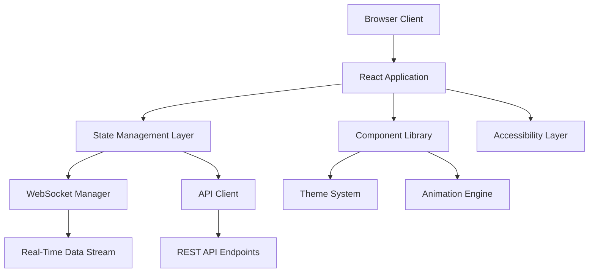
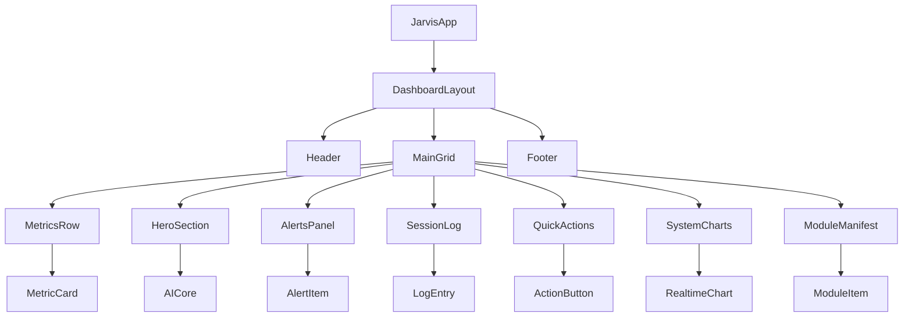
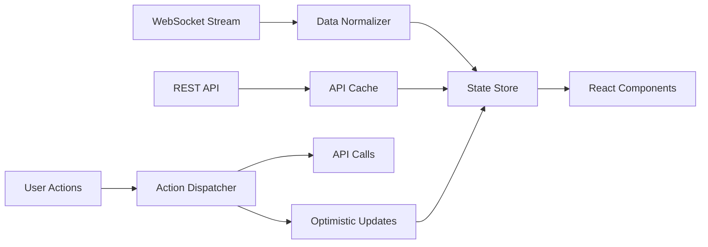

# Technical Design Document

## Overview

The JARVIS Neural Interface is a sophisticated real-time dashboard application that combines cyberpunk aesthetics with enterprise-grade functionality. The system implements a modern web architecture using React with TypeScript, providing a responsive and accessible interface for AI system monitoring and control.

### Key Design Principles

- **Information Density**: Maximize useful information display while maintaining visual clarity
- **Real-Time Responsiveness**: Sub-second data updates with smooth 60fps animations
- **Accessibility First**: WCAG AA compliance with comprehensive keyboard navigation
- **Performance Optimization**: Hardware-accelerated animations and optimized rendering
- **Responsive Design**: Seamless experience across desktop, tablet, and mobile devices

## Architecture

### System Architecture

The application follows a modern client-side architecture with real-time data integration:



### Technology Stack

**Frontend Framework**: React 18 with TypeScript
- Concurrent features for smooth real-time updates
- Strong typing for component interfaces and data models
- Hook-based architecture for state management

**State Management**: Zustand with React Query
- Lightweight state management for UI state
- React Query for server state and caching
- Real-time data synchronization

**Styling**: Tailwind CSS with custom design system
- Utility-first approach with design tokens
- Custom components for HUD elements
- Responsive grid system implementation

**Real-Time Communication**: WebSocket with fallback to polling
- Primary WebSocket connection for live data
- Automatic reconnection and error handling
- Polling fallback for unreliable connections

**Build System**: Vite with optimized bundling
- Fast development server with HMR
- Optimized production builds
- Code splitting for performance

**Testing**: Vitest with React Testing Library
- Unit tests for component logic
- Integration tests for data flow
- Accessibility testing with jest-axe

## Components and Interfaces

### Core Component Hierarchy



### Component Specifications

#### DashboardLayout Component
Manages the overall 12-column grid layout with responsive breakpoints.

```typescript
interface DashboardLayoutProps {
  children: React.ReactNode;
  isLoading: boolean;
  connectionStatus: ConnectionStatus;
}
```

**Responsive Breakpoints:**
- Desktop: 1200px+ (full 12-column layout)
- Tablet: 768-1199px (adapted 8-column layout)  
- Mobile: <768px (stacked single-column layout)

#### MetricsRow Component
Displays four real-time system metrics with 1-second update intervals.

```typescript
interface MetricCardProps {
  title: string;
  value: number;
  unit: string;
  trend: 'up' | 'down' | 'stable';
  status: 'normal' | 'warning' | 'critical';
  updateInterval: number; // milliseconds
}
```

#### AICore Component
Central HUD visualization with circular status display and animated indicators.

```typescript
interface AICoreProps {
  status: 'online' | 'processing' | 'error' | 'maintenance';
  processingLoad: number; // 0-100
  responseTime: number; // milliseconds
  coreMetrics: CoreMetrics;
  onDiagnosticClick: () => void;
}

interface CoreMetrics {
  uptime: number;
  tasksCompleted: number;
  errorRate: number;
  averageResponseTime: number;
}
```

#### RealtimeChart Component
Configurable chart component for system telemetry visualization.

```typescript
interface RealtimeChartProps {
  data: TimeSeriesData[];
  chartType: 'line' | 'area' | 'bar';
  timeWindow: number; // minutes of history
  updateInterval: number; // milliseconds
  color: string;
  title: string;
  yAxisLabel: string;
}
```

### Theme System Interface

```typescript
interface ThemeConfig {
  colors: {
    background: '#050A12';
    surface: '#0D1522';
    primary: '#00D4FF';
    secondary: '#8B5CF6';
    success: '#00E58B';
    warning: '#FFB020';
    error: '#FF4D67';
    textPrimary: '#E6EDF7';
    textSecondary: '#94A3B8';
    border: 'rgba(255,255,255,0.08)';
  };
  spacing: {
    gridUnit: 8; // Base 8px grid system
  };
  animation: {
    duration: {
      fast: 100;
      normal: 200;
      slow: 300;
    };
    easing: 'cubic-bezier(0.4, 0.0, 0.2, 1)';
  };
  breakpoints: {
    mobile: 768;
    tablet: 1024;
    desktop: 1200;
  };
}
```

## Data Models

### Real-Time Data Structures

#### SystemMetrics Model
Core system performance metrics updated every second.

```typescript
interface SystemMetrics {
  timestamp: number;
  cpu: {
    usage: number; // 0-100 percentage
    cores: number;
    frequency: number; // MHz
  };
  memory: {
    used: number; // bytes
    total: number; // bytes
    percentage: number; // 0-100
  };
  network: {
    bytesIn: number;
    bytesOut: number;
    packetsIn: number;
    packetsOut: number;
  };
  tasks: {
    active: number;
    completed: number;
    failed: number;
    queued: number;
  };
}
```

#### AlertSystem Model
Critical system alerts with severity levels and timestamps.

```typescript
interface SystemAlert {
  id: string;
  timestamp: number;
  severity: 'info' | 'warning' | 'error' | 'critical';
  category: 'system' | 'network' | 'security' | 'performance';
  title: string;
  message: string;
  acknowledged: boolean;
  actions?: AlertAction[];
}

interface AlertAction {
  label: string;
  action: string;
  destructive?: boolean;
}
```

#### SessionLog Model
Terminal session output with syntax highlighting support.

```typescript
interface LogEntry {
  id: string;
  timestamp: number;
  level: 'debug' | 'info' | 'warn' | 'error';
  category: string;
  message: string;
  metadata?: Record<string, any>;
}

interface SessionLogState {
  entries: LogEntry[];
  isAutoScrolling: boolean;
  scrollPosition: number;
  activeFilters: string[];
}
```

#### ModuleManifest Model
System module registry with status and dependency tracking.

```typescript
interface SystemModule {
  id: string;
  name: string;
  version: string;
  status: 'active' | 'inactive' | 'error' | 'updating';
  health: 'healthy' | 'degraded' | 'failed';
  dependencies: string[];
  lastUpdate: number;
  metrics: {
    uptime: number;
    errorRate: number;
    responseTime: number;
  };
}
```

### Data Flow Architecture



### State Management Strategy

**Global State (Zustand)**:
- UI preferences and settings
- Current user session
- Dashboard layout configuration
- Theme and accessibility preferences

**Server State (React Query)**:
- Real-time metrics data with 1-second stale time
- System alerts with background updates
- Module manifest with 30-second refetch
- Historical chart data with smart caching

**Local Component State**:
- Form inputs and validation
- Animation states
- Temporary UI interactions
- Modal and dropdown states

## Error Handling

### Connection Management

```typescript
interface ConnectionManager {
  websocket: WebSocketConnection;
  restApi: ApiClient;
  
  handleDisconnection(): void;
  attemptReconnection(): Promise<boolean>;
  fallbackToPolling(): void;
  restoreWebSocket(): Promise<void>;
}
```

**Connection States**:
- `connected`: Full real-time functionality
- `reconnecting`: Automatic retry with exponential backoff
- `degraded`: Polling fallback with reduced update frequency
- `offline`: Cached data only with user notification

### Error Boundary Strategy

**Component Error Boundaries**:
- Individual panel isolation to prevent cascade failures
- Graceful degradation with error state display
- Automatic error reporting with user context

**Data Error Handling**:
- Stale data retention during connection issues
- User-friendly error messages with action suggestions
- Automatic retry mechanisms with circuit breaker pattern

## Correctness Properties

*A property is a characteristic or behavior that should hold true across all valid executions of a system-essentially, a formal statement about what the system should do. Properties serve as the bridge between human-readable specifications and machine-verifiable correctness guarantees.*

### Property 1: Status Color Mapping Consistency

*For any* system status value (error, warning, success, normal, critical, etc.), the system SHALL map it to the correct color code according to the design specification.

**Validates: Requirements 1.4, 8.2, 12.3**

### Property 2: Real-Time Data Update Timing

*For any* metrics data stream (CPU, Memory, Network, Tasks), the system SHALL update the display within the maximum 1-second refresh interval.

**Validates: Requirements 5.1, 5.2, 5.3, 5.4**

### Property 3: Accessibility Compliance

*For any* interactive UI element, the system SHALL provide proper keyboard navigation, ARIA labels, focus indicators, and semantic HTML structure.

**Validates: Requirements 4.2, 4.3, 4.6, 4.7**

### Property 4: UI Interaction Standards

*For any* interactive element, the system SHALL meet minimum touch target sizes (44px) and respond to user interactions within 100ms with appropriate transition timing (200ms).

**Validates: Requirements 3.6, 6.1, 6.4**

### Property 5: Alert Prioritization Logic

*For any* set of system alerts with varying severity levels, the system SHALL display them in correct priority order with appropriate visual hierarchy.

**Validates: Requirements 7.4**

### Property 6: Log Data Processing

*For any* log entry data, the system SHALL apply correct syntax highlighting based on log type and support accurate filtering by severity level and category.

**Validates: Requirements 9.4, 9.5**

### Property 7: Destructive Action Confirmation

*For any* system action, the system SHALL display confirmation dialogs if and only if the action is classified as destructive.

**Validates: Requirements 10.5**

### Property 8: Design System Consistency

*For any* UI elements using the design system, the system SHALL apply consistent color schemes, hover states, and spacing following the 8px grid system.

**Validates: Requirements 11.6, 13.4, 13.5**

### Property 9: Color Contrast Validation

*For any* color combination used in the interface, the system SHALL maintain WCAG AA compliant contrast ratios for accessibility.

**Validates: Requirements 4.4**

## Testing Strategy

### Unit Testing Approach

**Component Tests**:
- Render testing for all visual components
- Props validation and default behavior
- Event handling and user interactions
- Accessibility compliance (jest-axe)

**Hook Tests**:
- Custom hook logic and state management
- Data fetching and caching behavior
- Error handling and edge cases

**Utility Tests**:
- Data transformation functions
- Theme calculations and responsive utilities
- Performance optimization helpers

### Property-Based Testing Configuration

**Testing Library**: Fast-Check (JavaScript property-based testing)
- Minimum 100 iterations per property test for comprehensive coverage
- Random data generation for robust edge case detection
- Shrinking capability to find minimal failing examples

**Property Test Implementation**:
Each correctness property will be implemented as a property-based test with proper tagging:

```typescript
// Example property test structure
test('Feature: jarvis-neural-interface, Property 1: Status Color Mapping Consistency', 
  fc.asyncProperty(
    fc.oneof(fc.constant('error'), fc.constant('warning'), fc.constant('success')),
    async (status) => {
      const color = getStatusColor(status);
      expect(color).toBe(STATUS_COLOR_MAP[status]);
    }
  ), 
  { numRuns: 100 }
);
```

**Property Test Categories**:
- **Data Processing Properties**: Log filtering, status mapping, alert prioritization
- **UI Behavior Properties**: Timing, sizing, accessibility compliance  
- **Design System Properties**: Color consistency, spacing, interaction states

### Integration Testing

**Data Flow Tests**:
- WebSocket connection and message handling
- API integration with error scenarios
- State synchronization across components

**User Journey Tests**:
- Critical path navigation and interactions
- Real-time data display accuracy
- Alert handling and acknowledgment flows

### Performance Testing

**Metrics Validation**:
- 60fps animation performance under load
- Memory usage during extended sessions
- Bundle size optimization verification

**Real-Time Performance**:
- Data update latency measurement
- UI responsiveness during high-frequency updates
- Connection stability testing

### Accessibility Testing

**Automated Testing**:
- WCAG AA compliance verification
- Color contrast validation
- Semantic HTML structure verification

**Manual Testing**:
- Screen reader compatibility
- Keyboard-only navigation
- Focus management during dynamic updates

## Implementation Roadmap

### Phase 1: Core Infrastructure (Weeks 1-2)
- Project setup with Vite and TypeScript
- Base component library with theme system
- Responsive grid layout implementation
- WebSocket connection management

### Phase 2: Dashboard Layout (Weeks 3-4)
- Header, footer, and main grid components
- Metrics row with real-time data integration
- AI Core central visualization
- Basic alert system implementation

### Phase 3: Advanced Features (Weeks 5-6)
- Session log with syntax highlighting
- Quick actions with confirmation dialogs
- Real-time charts with historical data
- Module manifest with status tracking

### Phase 4: Polish and Optimization (Weeks 7-8)
- Performance optimization and code splitting
- Comprehensive accessibility implementation
- Animation refinement and micro-interactions
- Testing suite completion and documentation

Each phase includes comprehensive testing, accessibility validation, and performance optimization to ensure the final product meets all requirements for a premium cyberpunk AI dashboard experience.