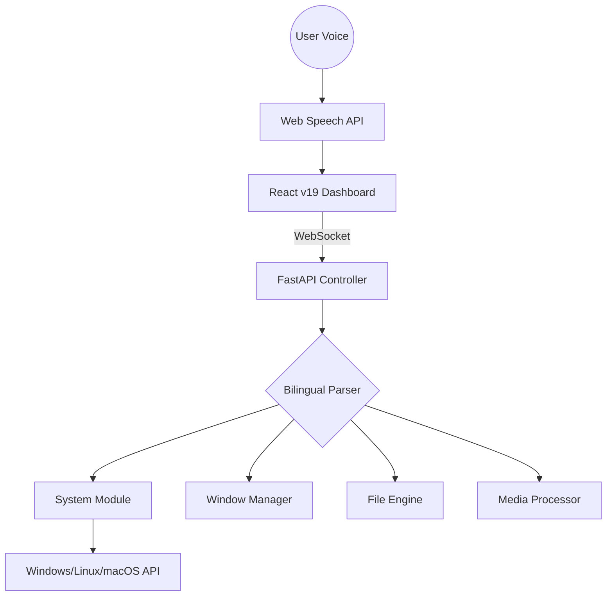

<div align="center">


# 🤖 JARVIS

### **The Ultimate Bilingual AI System Assistant**

[](https://github.com/VIPHACKER100/jarvis-bilingual-adv-ai-assistant)
[](https://reactjs.org/)
[](https://python.org/)
[](https://fastapi.tiangolo.com/)


**A futuristic, voice-activated system controller for Windows, macOS, and Linux.**  
*Bilingual (English/Hindi) • 100+ Commands • Full Hardware Control*

[Setup Guide](docs/SETUP.md) • [Command List](docs/COMMANDS.md) • [Troubleshooting](docs/TROUBLESHOOTING.md)

---
</div>

---

## 🌟 Modern Capabilities (v2.1)

### 🚀 **What's New?**

- 🌐 **Web Search Integration** - Smarter "new tab" and "search" command parsing for seamless browsing.
- 🎯 **Domain Detection** - Instantly open websites like `hackerone.com` or `google.com` by name.
- 🧠 **LLM Fallback** - Robust Sequential Model strategy with OpenRouter redundancy.
- 🏗️ **Build v2.1** - Optimized PyInstaller bundling for a faster, lighter executable.

---

## 🛠️ Core System Pillars

<table align="center">
  <tr>
    <td width="33%" align="center"><b>📡 System Monitoring</b></td>
    <td width="33%" align="center"><b>🪟 Window Control</b></td>
    <td width="33%" align="center"><b>📄 File & Media</b></td>
  </tr>
  <tr>
    <td valign="top">
      - Real-time CPU/GPU tracking<br>
      - Battery & Power diagnostics<br>
      - Network & Disk health stats<br>
      - Brightness & Volume control
    </td>
    <td valign="top">
      - Smart App Launching<br>
      - Window Snapping/Resizing<br>
      - Active App Management<br>
      - Taskbar & Shell toggles
    </td>
    <td valign="top">
      - Advanced File Search<br>
      - Image/PDF OCR Extraction<br>
      - PDF Merging & Splitting<br>
      - Batch Image Compression
    </td>
  </tr>
</table>

---

---

## ✨ Complete Feature List

### 🎙️ Voice & Language

- **Bilingual Voice Recognition** - English and Hindi (Hinglish supported)
- **Natural Text-to-Speech** - Responds in user's language
- **Mixed Language Support** - "Volume badhao" or "Play song on YouTube"
- **100+ Voice Commands** - All features accessible via voice

### 💻 System Control

- **Real-time Monitoring** - CPU, Memory, Battery, Disk, Network stats
- **Power Management** - Shutdown, Restart, Sleep (with confirmations)
- **Volume Control** - Up/Down/Mute
- **System Info** - Time, Date, Battery status, Uptime
- **Notifications** - System toast notifications

### 🪟 Window Management

- **Applications** - Open, close, list running apps
- **Window Control** - Minimize, maximize, restore, close
- **Window Position** - Move, resize, snap to edges
- **Desktop** - Show desktop, toggle taskbar

### 🖱️ Input Automation

- **Mouse Control** - Move to coordinates, click, double-click, right-click
- **Scrolling** - Up, down, horizontal
- **Dragging** - Drag and drop operations
- **Keyboard** - Type text, press keys, hotkey combinations
- **Human-like Delays** - 50-150ms between actions

### 📱 WhatsApp Integration

- **WhatsApp Web** - Open and send messages
- **WhatsApp Desktop** - Full automation support
- **Smart Contacts** - Fuzzy matching for contact names
- **Voice Calls** - Initiate calls

### 📁 File Management

- **Quick Access** - Downloads, Documents, Desktop, Pictures
- **File Operations** - Create, delete, copy, move, rename
- **Search** - Find files by name
- **Information** - File size, type, dates
- **Safety** - Delete moves to trash (recoverable)

### 🖼️ OCR & Text Extraction

- **From Images** - Extract text from any image
- **From PDFs** - Extract text from PDF documents
- **From Screenshots** - Capture and extract text from screen
- **Multi-language** - Supports English and Hindi text

### 📄 PDF Tools

- **Merge** - Combine multiple PDFs
- **Split** - Extract specific pages
- **Convert** - PDF to images, images to PDF
- **Compress** - Reduce PDF file size

### 🎨 Image Processing

- **Convert** - PNG ↔ JPG ↔ WEBP ↔ BMP
- **Resize** - Change dimensions
- **Compress** - Reduce file size
- **Batch** - Process multiple images

### 📸 Desktop Utilities

- **Screenshots** - Full screen or region
- **Clipboard** - Copy/paste text
- **Media Controls** - Play, pause, next, previous, stop
- **Screen Info** - Resolution, position

---

## 🚀 Quick Start

### Prerequisites

- **Node.js** 18+
- **Python** 3.11+
- **Git**
- **Chrome or Edge** (for voice recognition)

### Installation

```bash
# Clone repository
git clone https://github.com/VIPHACKER100/jarvis-bilingual-adv-ai-assistant.git
cd jarvis-bilingual-adv-ai-assistant

# Install frontend dependencies
npm install

# Setup Python backend
cd backend
python -m venv venv

# Windows
venv\Scripts\activate

# macOS/Linux
source venv/bin/activate

# Install Python dependencies
pip install -r requirements.txt

cd ..
```

### Running the Application

**Terminal 1 - Backend:**

```bash
cd backend
venv\Scripts\activate  # Windows
source venv/bin/activate  # macOS/Linux
python main.py
```

**Terminal 2 - Frontend:**

```bash
npm run dev
```

**Open browser:** <http://localhost:5173>

---

## 🎮 How to Use

1. **Click the Arc Reactor** to activate JARVIS
2. **Allow microphone access** when prompted
3. **Toggle language** (EN/हिंदी) in top right
4. **Speak naturally** - examples below:

### System Commands

```text
"What time is it?" / "Samay kya hai?"
"Shutdown computer" / "Computer band karo"
"Volume up" / "Aawaz badhao"
"Battery status" / "Battery kitni hai?"
```

### Application Commands

```text
"Open Chrome" / "Chrome kholo"
"Close Notepad" / "Notepad band karo"
"Minimize window" / "Window chhota karo"
"Show desktop" / "Desktop dikhavo"
```

### File Commands

```text
"Open Downloads" / "Downloads kholo"
"Search file report" / "File report dhoondo"
"Create folder Projects" / "Projects folder banao"
"Take screenshot" / "Screenshot lo"
```

### Media Commands

```text
"Extract text from image" / "Image se text nikalo"
"Convert image to PDF" / "Image ko PDF banao"
"Merge PDFs" / "PDFs jodo"
"Resize image to 800x600" / "Image 800x600 karo"
```

### Input Commands

```text
"Type hello world" / "Hello world likho"
"Move cursor to 500 300" / "Cursor 500 300 le jao"
"Click" / "Click karo"
"Press Enter" / "Enter daba"
"Copy" / "Copy karo"
```

### Media Control

```text
"Play music" / "Music chalao"
"Next song" / "Agla gaana"
"Pause" / "Pause karo"
```

---

## 📊 Technical Architecture



### **The Tech Stack**

- **Frontend**: `React 19`, `TypeScript 5.8`, `Tailwind CSS`
- **Backend**: `Python 3.11`, `FastAPI`, `PyAutoGUI`
- **Intelligence**: `Bilingual Parser`, `OpenRouter LLM`
- **Processing**: `Tesseract OCR`, `Pillow`, `PyPDF2`

---

---

## 📊 Technical Specifications

- **Total Code**: ~5,500 lines
- **Frontend**: React 19, TypeScript 5.8, 3,000+ lines
- **Backend**: Python 3.11, FastAPI, 2,500+ lines
- **API Endpoints**: 50+ REST + WebSocket
- **Voice Commands**: 100+ bilingual
- **Modules**: 15 Python modules
- **Platforms**: Windows, macOS, Linux

---

## 📁 Project Structure

```text
jarvis-bilingual-adv-ai-assistant/
├── src/                          # Frontend
│   ├── components/               # React components
│   │   ├── ArcReactor.tsx
│   │   ├── HistoryLog.tsx
│   │   ├── ConfirmationModal.tsx
│   │   └── PermissionModal.tsx
│   ├── services/                 # API clients
│   │   ├── websocketService.ts
│   │   └── apiClient.ts
│   ├── hooks/                    # Custom hooks
│   │   └── useJarvisBridge.ts
│   ├── types/                    # TypeScript types
│   │   └── bridge.ts
│   └── App.tsx                   # Main app
│
├── backend/                      # Python backend
│   ├── modules/                  # Feature modules
│   │   ├── system.py
│   │   ├── window_manager.py
│   │   ├── input_control.py
│   │   ├── file_manager.py
│   │   ├── media.py
│   │   ├── desktop.py
│   │   ├── whatsapp.py
│   │   ├── security.py
│   │   └── bilingual_parser.py
│   ├── utils/                    # Utilities
│   │   ├── platform_utils.py
│   │   └── logger.py
│   ├── config.py                 # Configuration
│   ├── main.py                   # Entry point
│   └── requirements.txt          # Dependencies
│
├── docs/                         # Documentation
│   ├── SETUP.md
│   ├── API_DOCUMENTATION.md
│   └── COMMANDS.md
│
└── README.md                     # This file
```

---

## 🔒 Security Features

- ✅ **Confirmation System** - Dangerous actions require user approval
- ✅ **30-Second Timeout** - Auto-cancel if no response
- ✅ **Safe File Operations** - Delete moves to trash, not permanent
- ✅ **Input Validation** - All commands validated
- ✅ **No Data Collection** - Everything stays local
- ✅ **Phishing Detection** - Warns about suspicious commands

---

## 🛠️ Development

### Environment Setup

Create `backend/.env`:

```env
BACKEND_PORT=8000
FRONTEND_URL=http://localhost:5173
CONFIRMATION_TIMEOUT=30
LOG_LEVEL=INFO
LOG_RETENTION_DAYS=30
```

### Adding New Commands

1. Add command mapping in `backend/config.py`:

```python
'new_command': ['command', 'hindi_command'],
```

1. Implement handler in appropriate module

2. Add route in `backend/main.py`

3. Test via WebSocket or REST API

---

## 🐛 Troubleshooting

### Backend won't start

```bash
# Check Python version (need 3.11+)
python --version

# Reinstall dependencies
cd backend
pip install -r requirements.txt --force-reinstall
```

### Frontend can't connect

```bash
# Check backend is running
# Verify ports (backend: 8000, frontend: 5173)
# Check CORS in backend/main.py
```

### Microphone not working

- Use Chrome or Edge (best Web Speech support)
- Check browser permissions
- Ensure microphone not in use by other app

### OCR not working (Windows)

```bash
# Install Tesseract OCR from:
# https://github.com/UB-Mannheim/tesseract/wiki
# Add to PATH: C:\Program Files\Tesseract-OCR
```

---

## �️ Security & Privacy

- 🔐 **Confirmation System** - Dangerous actions require explicit user approval.
- ⏱️ **Auto-Cancel** - 30-second timeout if no response is received.
- 🗑️ **Safe Deletion** - All file deletions move to the recycle bin first.
- 👤 **Local Processing** - Most operations stay strictly on your device.
- 🛡️ **No Tracking** - Private, secure, and data-collection free.

---

## 🤝 Community & Support

- **Bugs?** [Open an Issue](https://github.com/VIPHACKER100/jarvis-bilingual-adv-ai-assistant/issues)
- **Help?** [Full Setup Guide](docs/SETUP.md)
- **Features?** Fork and submit a PR!

---

## � Connect with VIPHACKER100

| Channel | Link |
|---------|------|
| 🌐 **Website** | [viphacker100.com](https://viphacker100.com) |
| 💻 **GitHub** | [@VIPHACKER100](https://github.com/VIPHACKER100) |
| 💼 **LinkedIn** | [Aryan Ahirwar](https://linkedin.com/in/viphacker100) |
| 📸 **Instagram** | [@viphacker100](https://instagram.com/viphacker100) |

---

<div align="center">

### **JARVIS - The Future of System Control**

#### *"I'm here to help."*

Built with 🤍 by **VIPHACKER100**

⭐ **Star this repo if you find it useful!**

</div>
