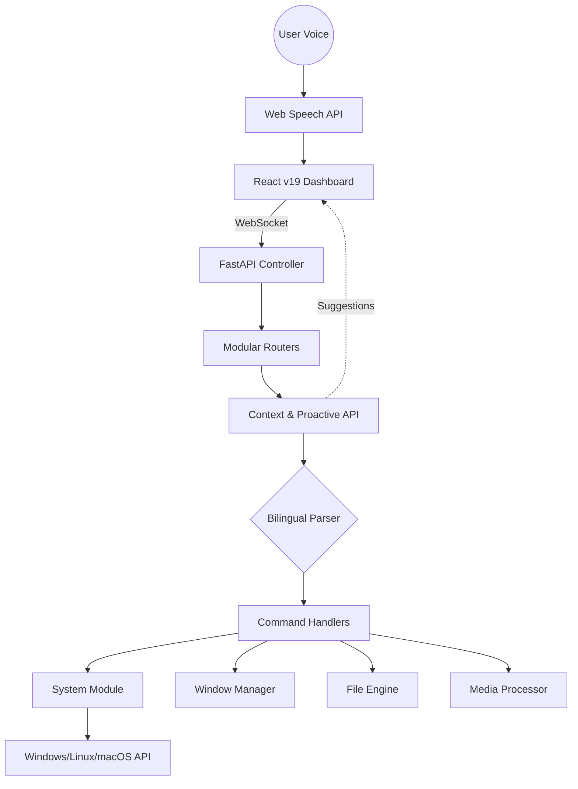

# 🤖 JARVIS

## The Ultimate Bilingual AI System Assistant


[](https://github.com/VIPHACKER100/jarvis-bilingual-adv-ai-assistant)
[](https://reactjs.org/)
[](https://python.org/)
[](https://fastapi.tiangolo.com/)


**A futuristic, voice-activated system controller for Windows, macOS, and Linux.**  
*Bilingual (English/Hindi) • 100+ Commands • Full Hardware Control*

[Setup Guide](docs/SETUP.md) • [Command List](docs/COMMANDS.md) • [Troubleshooting](docs/TROUBLESHOOTING.md)

---

---

## 🌟 Modern Capabilities (v4.0.0-alpha.2)

- 🎙️ **Local Voice Activation** - "Hey JARVIS" wake-word detection using `openwakeword` for a hands-free experience.
- 📱 **Mobile Companion Ecosystem** - Secure pairing and real-time remote control via the new JARVIS Mobile app.
- 📡 **mDNS Auto-Discovery** - Zero-configuration network discovery for seamless mobile-to-backend connections.
- ⚡ **Contextual Intelligence API** - Proactive analysis layer that suggests next actions based on system state.
- 🚀 **Event Loop Optimization** - 50% reduction in latency by offloading hardware probes to background threads.
- 🛡️ **Self-Healing Database** - Proactive schema validation that automatically repairs missing tables.
- 📱 **Haptic Feedback Sync** - Real-time tactile confirmation on mobile devices for voice triggers.
- 🧠 **Neural Feedback Loop** - Autonomous agent learns from user rejections and timeout decisions to refine future proactive suggestions.
- 🔒 **TypeScript Strict Types** - Zero `any` types. 350+ interfaces mirror all backend Pydantic models.
- 🛡️ **Security Hardening** - All CodeQL SAST findings resolved: bad HTML regex, incomplete sanitization, information exposure through exceptions.

### 🚀 **What's New? (v4.0.0-alpha.2)**

- 🗄️ **PostgreSQL + pgvector** — Migrated from SQLite to PostgreSQL with pgvector extension for native semantic vector search. In-memory numpy cosine similarity replaced with `<=>` SQL queries.
- 🔌 **LLM Gateway Unification** — Collapsed 3 OpenAI-compatible adapters into a single `OpenAICompatibleAdapter`. Switched from synchronous `OpenAI()` + `asyncio.to_thread()` to native `AsyncOpenAI()`. Added Google Gemini adapter.
- 📝 **Structured Logging** — Migrated 41 files from `utils.logger` to `utils.logger_structured` (structlog + OpenTelemetry). Production JSON log output.
- 🔢 **API Versioning** — Agent and audio routers moved under `/api/v1/` prefix for clean API versioning.
- 🛡️ **Security Audit** — API key authentication on all agent endpoints with constant-time comparison via `hmac.compare_digest`. WebSocket auth gate with `api_key` query parameter. X-Forwarded-For spoofing eliminated.
- 🤖 **Opencode Agents** — 6 agent definitions for specialized development: backend-dev, frontend-dev, test-runner, database-migrator, CODEX, code-reviewer.
- 📊 **CODEX Code Review** — Autonomous code review agent scoring across 6 dimensions (readability, correctness, security, performance, maintainability, style).
- 🎵 **Streaming Audio Fixes** — `stopCurrentAudio()` lifecycle management, consolidated play functions, audio onerror handler for decode failures.
- ✅ **72/72 Tests Passing** — Full test suite passing (47 backend + 25 frontend), zero regressions.

### 🚀 **What's New? (v3.9.0)**

- ✨ **Voice Activation** - Hands-free "Hey JARVIS" trigger with offline ONNX-powered detection.
- 📱 **Mobile Pairing** - Secure TTL-based 6-digit sync for remote system monitoring.
- 🛰️ **Auto-Discovery** - Automatic backend detection on local networks via ZeroConf/mDNS.
- 🧠 **Autonomous Agentic Loop** - ReAct framework allowing the assistant to reason and use tools autonomously for complex queries.
- 📜 **Agent Trace Auditing** - Full visibility into the LLM's thought process logged locally to `memory/agent_traces.md`.
- 🛠️ **Infrastructure Hardening** - Resolved PyInstaller bundling issues for `numpy` and `openwakeword`.

---

## 🛠️ Core System Pillars

### 📡 System Monitoring

- Real-time CPU/GPU tracking
- Battery & Power diagnostics
- Network & Disk health stats
- Brightness & Volume control

### 🪟 Window Control

- Smart App Launching
- Window Snapping/Resizing
- Active App Management
- Taskbar & Shell toggles

### 📄 File & Media

- Advanced File Search
- Image/PDF OCR Extraction
- PDF Merging & Splitting
- Batch Image Compression

---

---

## ✨ Complete Feature List

### 🎙️ Voice & Language

- **Bilingual Voice Recognition** - English and Hindi (Hinglish supported)
- **Natural Text-to-Speech** - Responds in user's language with adaptive pitch control for Hinglish
- **Mixed Language Support** - "Volume badhao" or "Play song on YouTube"
- **100+ Voice Commands** - All features accessible via voice

### 💻 System Control

- **Real-time Monitoring** - CPU, Memory, Battery, Disk, Network stats
- **Power Management** - Shutdown, Restart, Sleep (with confirmations)
- **Volume Control** - Up/Down/Mute
- **System Info** - Time, Date, Battery status, Uptime
- **Notifications** - System toast notifications

### 🪟 Window Management

- **Applications** - Open, close, list running apps
- **Window Control** - Minimize, maximize, restore, close
- **Window Position** - Move, resize, snap to edges
- **Desktop** - Show desktop, toggle taskbar

### 🖱️ Input Automation

- **Mouse Control** - Move to coordinates, click, double-click, right-click
- **Scrolling** - Up, down, horizontal
- **Dragging** - Drag and drop operations
- **Keyboard** - Type text, press keys, hotkey combinations
- **Human-like Delays** - 50-150ms between actions

### 📱 WhatsApp Integration

- **WhatsApp Web** - Open and send messages
- **WhatsApp Desktop** - Full automation support
- **Smart Contacts** - Fuzzy matching for contact names
- **Voice Calls** - Initiate calls

### 📁 File Management

- **Quick Access** - Home, Downloads, Documents, Desktop, Pictures, Videos, Music
- **File Operations** - Create, delete, copy, move, rename
- **Search** - Find files by name (Noun-first supported)
- **Information** - File size, type, dates
- **Safety** - Delete moves to trash (recoverable)

### 🖼️ OCR & Text Extraction

- **From Images** - Extract text from any image
- **From PDFs** - Extract text from PDF documents
- **From Screenshots** - Capture and extract text from screen
- **Multi-language** - Supports English and Hindi text

### 📄 PDF Tools

- **Merge** - Combine multiple PDFs
- **Split** - Extract specific pages
- **Convert** - PDF to images, images to PDF
- **Compress** - Reduce PDF file size

### 🎨 Image Processing

- **Convert** - PNG ↔ JPG ↔ WEBP ↔ BMP
- **Resize** - Change dimensions
- **Compress** - Reduce file size
- **Batch** - Process multiple images

### 📸 Desktop Utilities

- **Screenshots** - Full screen or region
- **Clipboard** - Copy/paste text
- **Media Controls** - Play, pause, next, previous, stop
- **Screen Info** - Resolution, position

---

## 🚀 Quick Start

### Prerequisites

- **Node.js** 18+
- **Python** 3.13+
- **Git**
- **Chrome or Edge** (for voice recognition)

### Installation

```bash
# Clone repository
git clone https://github.com/VIPHACKER100/jarvis-bilingual-adv-ai-assistant.git
cd jarvis-bilingual-adv-ai-assistant

# Install frontend dependencies
npm install

# Setup Python backend
cd backend
python -m venv venv

# Windows
venv\Scripts\activate

# macOS/Linux
source venv/bin/activate

# Install Python dependencies
pip install -r requirements.txt

cd ..
```

### Running the Application

**Terminal 1 - Backend:**

```bash
cd backend
venv\Scripts\activate  # Windows
source venv/bin/activate  # macOS/Linux
python main.py
```

**Terminal 2 - Frontend:**

```bash
npm run dev
```

**Open browser:** <http://localhost:5173>

---

## 🎮 How to Use

1. **Click the Arc Reactor** to activate JARVIS
2. **Allow microphone access** when prompted
3. **Toggle language** (EN/हिंदी) in top right
4. **Speak naturally** - examples below:

### System Commands

```text
"What time is it?" / "Samay kya hai?"
"Shutdown computer" / "Computer band karo"
"Volume up 20%" / "Aawaz 20 percent badhao"
"Battery status" / "Battery kitni hai?"
```

### Application Commands

```text
"Open Chrome" / "Chrome kholo"
"Open Notepad" / "नोटपैड खोलो"
"Minimize window" / "Window chhota karo"
"Show desktop" / "Desktop dikhavo"
```

### File Commands

```text
"Open Downloads" / "Downloads kholo"
"Search file report" / "File report dhoondo"
"Create folder Projects" / "Projects folder banao"
"Take screenshot" / "Screenshot lo"
```

### Media Commands

```text
"Extract text from image" / "Image se text nikalo"
"Convert image to PDF" / "Image ko PDF banao"
"Merge PDFs" / "PDFs jodo"
"Resize image to 800x600" / "Image 800x600 karo"
```

### Input Commands

```text
"Type hello world" / "Hello world likho"
"Move cursor to 500 300" / "Cursor 500 300 le jao"
"Click" / "Click karo"
"Press Enter" / "Enter daba"
"Copy" / "Copy karo"
```

### Media Control

```text
"Play music" / "Music chalao"
"Next song" / "Agla gaana"
"Pause" / "Pause karo"
```

---

## 📊 Technical Architecture


```mermaid
graph TD
    User((User Voice)) --> Voice[Web Speech API]
    Voice --> Frontend[React v19 Dashboard]
    Frontend -- WebSocket --> Backend[FastAPI Controller]
    Backend --> Routers[Modular Routers]
    Routers --> Context[Context & Proactive API]
    Context --> LogicCore{Bilingual Parser}
    LogicCore --> Handlers[Command Handlers]
    Handlers --> System[System Module]
    Handlers --> Window[Window Manager]
    Handlers --> File[File Engine]
    Handlers --> Media[Media Processor]
    System --> OS[Windows/Linux/macOS API]
    Context -. Suggestions .-> Frontend
```

### **The Tech Stack**

- **Frontend**: `React 19`, `TypeScript 5.9`, `Vite`, `Tailwind CSS`, `Framer Motion`
- **Backend**: `Python 3.13`, `FastAPI`, `PyAutoGUI`, `SQLAlchemy`
- **Architecture**: `Modular Router System`, `Centralized Command Handlers`, `Proactive Intelligence API`
- **Intelligence**: `Neural Proactive Engine`, `Bilingual LLM Parser`, `Contextual Action Recommender`
- **Processing**: `Tesseract OCR`, `Pillow`, `PyPDF2`, `PostgreSQL + pgvector`

---

---

## 📊 Technical Specifications

- **Total Code**: ~6,800 lines
- **Frontend**: React 19, TypeScript 5.9, 3,800+ lines
- **Backend**: Python 3.13, FastAPI, 3,000+ lines
- **Architecture**: Modular 10+ Routers, 15+ Handlers
- **API Endpoints**: 65+ REST + WebSocket
- **Voice Commands**: 100+ bilingual
- **Platforms**: Windows, macOS, Linux

---

## 📁 Project Structure

```text
jarvis-bilingual-adv-ai-assistant/
├── src/                          # Frontend (Vite + React)
│   ├── components/               # UI Components (Glassmorphism)
│   │   ├── ArcReactor.tsx        # Central Core V3
│   │   ├── SystemDiagnostics.tsx # HUD V3
│   │   ├── HistoryLog.tsx
│   │   └── ...
│   ├── services/                 # API & WebSocket clients
│   ├── hooks/                    # Custom React hooks
│   ├── context/                  # Global State (Notifications, etc.)
│   ├── styles/                   # Premium Design System CSS
│   └── App.tsx                   # Main Dashboard
│
├── backend/                      # Python Backend (FastAPI)
│   ├── routers/                  # Modular API Routers
│   │   ├── system.py
│   │   ├── commands.py
│   │   └── ...
│   ├── handlers/                 # Command Logic Handlers
│   │   └── command_handler.py
│   ├── modules/                  # Lower-level feature modules
│   │   ├── system.py
│   │   ├── whatsapp.py
│   │   └── ...
│   ├── main.py                   # Server Entry Point
│   └── requirements.txt
│
├── docs/                         # Extended Documentation
└── README.md                     # Main Documentation
```

---

## 🔒 Security Features

- ✅ **Confirmation System** - Dangerous actions require user approval
- ✅ **30-Second Timeout** - Auto-cancel if no response
- ✅ **Safe File Operations** - Delete moves to trash, not permanent
- ✅ **Input Validation** - All commands validated
- ✅ **No Data Collection** - Everything stays local
- ✅ **Phishing Detection** - Warns about suspicious commands

---

## 🛠️ Development

### Environment Setup

Create `backend/.env`:

```env
BACKEND_PORT=8000
FRONTEND_URL=http://localhost:5173
CONFIRMATION_TIMEOUT=30
LOG_LEVEL=INFO
LOG_RETENTION_DAYS=30
```

### Adding New Commands

1. Add command mapping in `backend/config/commands.py`:

   ```python
   'new_command': ['command', 'hindi_command'],
   ```

2. Add a response mapping in `backend/config/responses.py`
3. Implement handler in appropriate module (`backend/modules/`)
4. Add route in `backend/handlers/command_handler.py`
5. Test via WebSocket or REST API

---

## 🐛 Troubleshooting

### Backend won't start

```bash
# Check Python version (need 3.13+)
python --version

# Reinstall dependencies
cd backend
pip install -r requirements.txt --force-reinstall
```

### Frontend can't connect

```bash
# Check backend is running
# Verify ports (backend: 8000, frontend: 5173)
# Check CORS in backend/main.py
```

### Microphone not working

- Use Chrome or Edge (best Web Speech support)
- Check browser permissions
- Ensure microphone not in use by other app

### OCR not working (Windows)

```bash
# Install Tesseract OCR from:
# https://github.com/UB-Mannheim/tesseract/wiki
# Add to PATH: C:\Program Files\Tesseract-OCR
```

---

## �️ Security & Privacy

- 🔐 **Confirmation System** - Dangerous actions require explicit user approval.
- ⏱️ **Auto-Cancel** - 30-second timeout if no response is received.
- 🗑️ **Safe Deletion** - All file deletions move to the recycle bin first.
- 👤 **Local Processing** - Most operations stay strictly on your device.
- 🛡️ **No Tracking** - Private, secure, and data-collection free.

---

## 🤝 Community & Support

- **Bugs?** [Open an Issue](https://github.com/VIPHACKER100/jarvis-bilingual-adv-ai-assistant/issues)
- **Help?** [Full Setup Guide](docs/SETUP.md)
- **Features?** Fork and submit a PR!

---

## � Connect with VIPHACKER100

| Channel | Link |
| --------- | ------ |
| 🌐 **Website** | [aryanahirwar.in](https://aryanahirwar.in) |
| 💻 **GitHub** | [@VIPHACKER100](https://github.com/VIPHACKER100) |
| 💼 **LinkedIn** | [Aryan Ahirwar](https://linkedin.com/in/viphacker100) |
| 📸 **Instagram** | [@viphacker100](https://instagram.com/viphacker100) |

---

---

### **JARVIS - The Future of System Control**

#### *"I'm here to help."*

Built with 🤍 by **VIPHACKER100 "Aryan Ahirwar"**

⭐ **Star this repo if you find it useful!**
