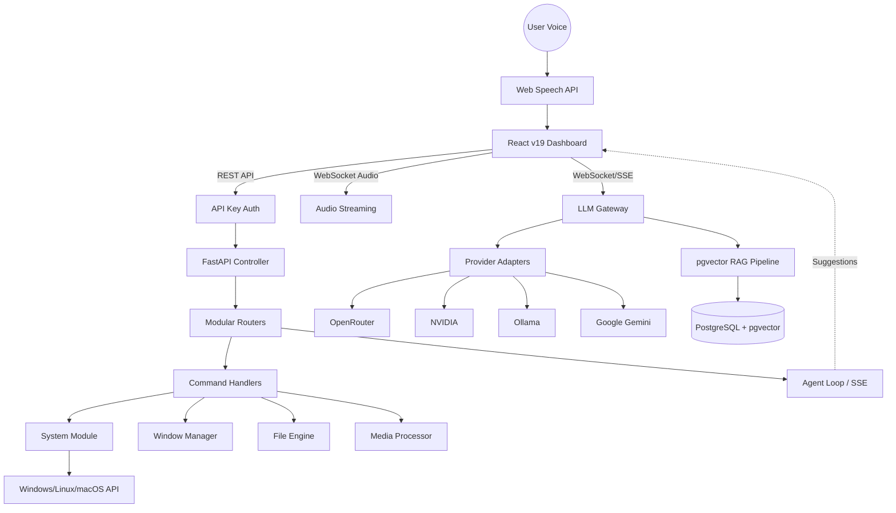

# JARVIS

## The Ultimate Bilingual AI System Assistant


[](https://github.com/VIPHACKER100/jarvis-bilingual-adv-ai-assistant)
[](https://python.org/)
[](https://fastapi.tiangolo.com/)
[](https://github.com/VIPHACKER100/jarvis-bilingual-adv-ai-assistant)

**A futuristic, voice-activated system controller for Windows, macOS, and Linux.**
*Bilingual (English/Hindi/Hinglish) • 100+ Commands • Full Hardware Control*

[Setup Guide](docs/SETUP.md) • [Command List](docs/COMMANDS.md) • [API Docs](docs/API_DOCUMENTATION.md)

---

## Current State (v4.0.0-alpha.4)

Python/FastAPI backend fully operational with 47/47 tests passing. React/TypeScript frontend in active development in `src/`.

### Backend — Fully Operational

- 🎙️ **Bilingual Voice Pipeline** — English, Hindi, and Hinglish via Web Speech API + Audio WebSocket
- 🧠 **LLM Gateway** — Multi-provider support (OpenRouter, NVIDIA NIM, Ollama, Google Gemini) with circuit breaker & cost tracker
- 🔌 **130+ REST Endpoints** — System, windows, files, desktop, media, input, memory, automation, WhatsApp, security, sync
- 🔗 **2 WebSocket Channels** — Main WS (commands/status/broadcasts) + Audio WS (STT/TTS streaming)
- 📡 **SSE Agent Streaming** — Real-time LLM response streaming with graceful truncation
- 🗄️ **PostgreSQL + pgvector** — Semantic vector search with asyncpg and Alembic migrations
- 🛡️ **Security Hardened** — API key auth (constant-time comparison), SQLi protection, rate limiting, CSP headers
- 🚀 **Async-First** — asyncio event loop with thread offloading for blocking I/O

### Frontend — In Development

- React/TypeScript frontend being built per requirements in `docs/`
- Voice-first interaction with Arc Reactor visual core

---

## Quick Start

### Prerequisites

- **Python** 3.13+
- **PostgreSQL** 16+ (or Docker)
- **Chrome or Edge** (for voice recognition)

### Installation

```bash
# Clone repository
git clone https://github.com/VIPHACKER100/jarvis-bilingual-adv-ai-assistant.git
cd jarvis-bilingual-adv-ai-assistant

# Start PostgreSQL + Redis (Docker)
docker compose up -d postgres redis

# Setup Python backend
cd backend
python -m venv venv

# Windows
venv\Scripts\activate

# macOS/Linux
source venv/bin/activate

# Install Python dependencies
pip install -r requirements.txt

# Apply database migrations
alembic upgrade head

cd ..
```

### Running the Backend

```bash
cd backend
venv\Scripts\activate  # Windows
source venv/bin/activate  # macOS/Linux
python main.py
```

The API server starts at **http://localhost:8000**.  
WebSocket available at **ws://localhost:8000/ws**.

### Frontend (once rebuilt)

```bash
npm run dev
```

Open **http://localhost:5173** in the browser.

---

## Core System Pillars

### System Monitoring

- Real-time CPU/GPU tracking
- Battery & Power diagnostics
- Network & Disk health stats
- Brightness & Volume control

### Window Control

- Smart App Launching
- Window Snapping/Resizing
- Active App Management
- Taskbar & Shell toggles

### File & Media

- Advanced File Search
- Image/PDF OCR Extraction
- PDF Merging & Splitting
- Batch Image Compression

---

## Complete Feature List

### Voice & Language

- **Bilingual Voice Recognition** — English, Hindi, and Hinglish
- **Natural Text-to-Speech** — Responds in user's language with adaptive pitch control for Hinglish
- **Mixed Language Support** — "Volume badhao" or "Play song on YouTube"
- **100+ Voice Commands** — All features accessible via voice

### System Control

- **Real-time Monitoring** — CPU, Memory, Battery, Disk, Network stats
- **Power Management** — Shutdown, Restart, Sleep (with confirmations)
- **Volume Control** — Up/Down/Mute
- **System Info** — Time, Date, Battery status, Uptime
- **Notifications** — System toast notifications

### Window Management

- **Applications** — Open, close, list running apps
- **Window Control** — Minimize, maximize, restore, close
- **Window Position** — Move, resize, snap to edges
- **Desktop** — Show desktop, toggle taskbar

### Input Automation

- **Mouse Control** — Move to coordinates, click, double-click, right-click
- **Scrolling** — Up, down, horizontal
- **Dragging** — Drag and drop operations
- **Keyboard** — Type text, press keys, hotkey combinations
- **Human-like Delays** — 50-150ms between actions

### WhatsApp Integration

- **WhatsApp Web** — Open and send messages
- **WhatsApp Desktop** — Full automation support
- **Smart Contacts** — Fuzzy matching for contact names
- **Voice Calls** — Initiate calls

### File Management

- **Quick Access** — Home, Downloads, Documents, Desktop, Pictures, Videos, Music
- **File Operations** — Create, delete, copy, move, rename
- **Search** — Find files by name (Noun-first supported)
- **Information** — File size, type, dates
- **Safety** — Delete moves to trash (recoverable)

### OCR & Text Extraction

- **From Images** — Extract text from any image
- **From PDFs** — Extract text from PDF documents
- **From Screenshots** — Capture and extract text from screen
- **Multi-language** — Supports English and Hindi text

### PDF Tools

- **Merge** — Combine multiple PDFs
- **Split** — Extract specific pages
- **Convert** — PDF to images, images to PDF
- **Compress** — Reduce PDF file size

### Image Processing

- **Convert** — PNG ↔ JPG ↔ WEBP ↔ BMP
- **Resize** — Change dimensions
- **Compress** — Reduce file size
- **Batch** — Process multiple images

### Desktop Utilities

- **Screenshots** — Full screen or region
- **Clipboard** — Copy/paste text
- **Media Controls** — Play, pause, next, previous, stop
- **Screen Info** — Resolution, position

---

## How to Use

1. **Click the Arc Reactor** to activate JARVIS
2. **Allow microphone access** when prompted
3. **Toggle language** (EN/हिंदी) in top right
4. **Speak naturally** — examples below:

### System Commands

```text
"What time is it?" / "Samay kya hai?"
"Shutdown computer" / "Computer band karo"
"Volume up 20%" / "Aawaz 20 percent badhao"
"Battery status" / "Battery kitni hai?"
```

### Application Commands

```text
"Open Chrome" / "Chrome kholo"
"Open Notepad" / "नोटपैड खोलो"
"Minimize window" / "Window chhota karo"
"Show desktop" / "Desktop dikhavo"
```

### File Commands

```text
"Open Downloads" / "Downloads kholo"
"Search file report" / "File report dhoondo"
"Create folder Projects" / "Projects folder banao"
"Take screenshot" / "Screenshot lo"
```

### Media Commands

```text
"Extract text from image" / "Image se text nikalo"
"Convert image to PDF" / "Image ko PDF banao"
"Merge PDFs" / "PDFs jodo"
"Resize image to 800x600" / "Image 800x600 karo"
```

### Input Commands

```text
"Type hello world" / "Hello world likho"
"Move cursor to 500 300" / "Cursor 500 300 le jao"
"Click" / "Click karo"
"Press Enter" / "Enter daba"
"Copy" / "Copy karo"
```

### Media Control

```text
"Play music" / "Music chalao"
"Next song" / "Agla gaana"
"Pause" / "Pause karo"
```

---

## Technical Architecture


```mermaid
graph TD
    User((User Voice)) --> Voice[Web Speech API]
    Voice --> Frontend[React v19 Dashboard]
    Frontend -- WebSocket/SSE --> Gateway[LLM Gateway]
    Frontend -- WebSocket Audio --> AudioStream[Audio Streaming]
    Frontend -- REST API --> Auth[API Key Auth]
    Auth --> Backend[FastAPI Controller]

    Backend --> Routers[Modular Routers]
    Routers --> Handlers[Command Handlers]
    Routers --> Agent[Agent Loop / SSE]

    Gateway --> Adapters[Provider Adapters]
    Adapters --> OpenRouter[OpenRouter]
    Adapters --> Nvidia[NVIDIA]
    Adapters --> Ollama[Ollama]
    Adapters --> Google[Google Gemini]

    Gateway --> RAG[pgvector RAG Pipeline]
    RAG --> PostgreSQL[(PostgreSQL + pgvector)]

    Handlers --> System[System Module]
    Handlers --> Window[Window Manager]
    Handlers --> File[File Engine]
    Handlers --> Media[Media Processor]
    System --> OS[Windows/Linux/macOS API]

    Agent -. Suggestions .-> Frontend
```

### The Tech Stack

- **Backend**: `Python 3.13`, `FastAPI`, `asyncpg`, `SQLAlchemy`, `structlog`
- **Database**: `PostgreSQL 16 + pgvector` (semantic vector search)
- **Frontend** *(planned)*: `React 19`, `TypeScript 5.9`, `Vite`, `Tailwind CSS`, `Framer Motion`
- **Architecture**: `Modular Router System`, `Centralized Command Handlers`, `LLM Gateway with Multi-Provider Failover`
- **Intelligence**: `Neural Proactive Engine`, `Bilingual LLM Parser`, `Contextual Action Recommender`, `Autonomous Agent Loop (ReAct)`
- **Processing**: `Tesseract OCR`, `Pillow`, `PyPDF2`
- **Infrastructure**: `Docker Compose`, `Nginx`, `Redis`, `Alembic Migrations`

---

## Technical Specifications

- **Total Code**: ~10,000 lines (backend)
- **Backend**: Python 3.13, FastAPI, modular 20+ routers, 15+ handlers
- **API Endpoints**: ~130+ REST + 2 WebSocket channels + SSE streaming
- **Database Tables**: 7 (PostgreSQL + pgvector)
- **Backend Tests**: 47 (100% pass)
- **Voice Commands**: 100+ bilingual
- **Platforms**: Windows, macOS, Linux

---

## Project Structure

```text
jarvis-bilingual-adv-ai-assistant/
├── backend/                      # Python Backend (FastAPI)
│   ├── routers/                  # 20 Modular API Routers
│   ├── handlers/                 # Command Logic Handlers
│   ├── modules/                  # Feature modules (system, whatsapp, …)
│   ├── utils/                    # Middleware, logging, security
│   ├── config/                   # Environment, commands, responses
│   └── main.py                   # Server Entry Point
│
├── docs/                         # Documentation
│   ├── API_DOCUMENTATION.md      # REST/WS API reference
│   ├── CHANGELOG.md              # Release history
│   ├── COMMANDS.md               # Voice command reference
│   ├── CONTRIBUTING.md           # Contribution guidelines
│   ├── SECURITY.md               # Security policies
│   ├── SETUP.md                  # Setup instructions
│   ├── TROUBLESHOOTING.md        # Common issues & fixes
│   └── assets/                   # Images (logo, etc.)
│
├── memory/                       # AI persistent memory system
├── .opencode/agents/             # AI agent definitions
│
├── docker-compose.yml            # PostgreSQL, Redis, services
├── nginx.conf                    # Reverse proxy config
├── CLAUDE.md                     # Project instructions for AI
└── README.md
```

---

## Security Features

- **Confirmation System** — Dangerous actions require user approval
- **30-Second Timeout** — Auto-cancel if no response
- **Safe File Operations** — Delete moves to trash, not permanent
- **Input Validation** — All commands validated
- **No Data Collection** — Everything stays local
- **Phishing Detection** — Warns about suspicious commands

---

## Development

### Building the Backend Executable

```bash
python scripts/build.py
```

Produces `JARVIS_v{VERSION}.zip` in the `release/` directory containing the backend executable, launcher, and config template.

### Environment Setup

Create `backend/.env`:

```env
BACKEND_PORT=8000
FRONTEND_URL=http://localhost:5173
BACKEND_API_KEY=your-api-key-here
CONFIRMATION_TIMEOUT=30
LOG_LEVEL=INFO
```

### Adding New Commands

1. Add command mapping in `backend/config/commands.py`
2. Add response mapping in `backend/config/responses.py`
3. Implement handler in appropriate module (`backend/modules/`)
4. Add route in `backend/handlers/command_handler.py`
5. Test via WebSocket or REST API

---

## Troubleshooting

### Backend won't start

```bash
# Check Python version (need 3.13+)
python --version

# Reinstall dependencies
cd backend
pip install -r requirements.txt --force-reinstall
```

### Microphone not working

- Use Chrome or Edge (best Web Speech support)
- Check browser permissions
- Ensure microphone not in use by other app

### OCR not working (Windows)

```bash
# Install Tesseract OCR from:
# https://github.com/UB-Mannheim/tesseract/wiki
# Add to PATH: C:\Program Files\Tesseract-OCR
```

---

## Community & Support

- **Bugs?** [Open an Issue](https://github.com/VIPHACKER100/jarvis-bilingual-adv-ai-assistant/issues)
- **Help?** [Full Setup Guide](docs/SETUP.md)
- **Features?** Fork and submit a PR!

---

## Connect with VIPHACKER100

| Channel | Link |
|---------|------|
| **Website** | [aryanahirwar.in](https://aryanahirwar.in) |
| **GitHub** | [@VIPHACKER100](https://github.com/VIPHACKER100) |
| **LinkedIn** | [Aryan Ahirwar](https://linkedin.com/in/viphacker100) |
| **Instagram** | [@viphacker100](https://instagram.com/viphacker100) |

---

### JARVIS — The Future of System Control

#### *"I'm here to help."*

Built with by **VIPHACKER100 "Aryan Ahirwar"**

**Star this repo if you find it useful!**
