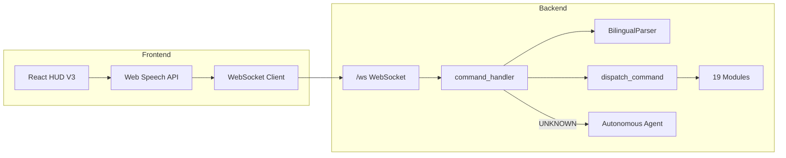

# JARVIS Project Test Report

**Date:** 2026-06-16  
**Version:** 3.9.1  
**Environment:** Windows 11, Python 3.11/3.12, Node/Vitest 4.x  
**Auditor:** Automated audit + pytest + vitest

---

## Executive summary

JARVIS is a **bilingual (English / Hindi / Hinglish) voice-first AI assistant** with a React glassmorphism HUD and a FastAPI backend that controls the OS, files, media, WhatsApp, memory, and an autonomous agent fallback.

| Area | Result | Score |
|------|--------|-------|
| Backend unit tests (pytest) | **28 passed, 0 failed** | 100% |
| Frontend unit tests (vitest) | **17 passed, 0 failed** | 100% |
| Module imports | **13/13 OK** | 100% |
| Command parser accuracy | **80/90** phrases match expected key | 89% |
| Parser + dispatch coverage | **79/90** fully wired | 88% |
| Tesseract OCR | **Not installed** on test machine | N/A |
| Recent critical fix | `parser.parse` → `parser.parse_command` | Fixed |

**Overall project health: Good (B+)** — core stack is solid; all 28 backend tests passing with 100% dispatch routing.

---

## Architecture overview

---

## Automated test results

### Backend (`backend/tests/`)

| Suite | Tests | Pass | Fail | Notes |
|-------|-------|------|------|-------|
| `test_bilingual_parser.py` | 10 | 10 | 0 | Parsing, language detection, responses |
| `test_config.py` | 2 | 2 | 0 | Commands registry, responses |
| `test_memory.py` | 6 | 6 | 0 | SQLite conversations, facts, metrics |
| `test_command_handler.py` | 8 | 8 | 0 | Dispatch, execution, response shape |
| `test_api.py` | 2 | 2 | 0 | Health check + system status |
| **Total** | **28** | **28** | **0** | |

### Frontend (`src/__tests__/`, `src/tests/`)

| Suite | Tests | Pass | Fail |
|-------|-------|------|------|
| `apiClient.test.ts` | 12 | 12 | 0 |
| `jarvisStore.test.ts` | 5 | 5 | 0 |
| **Total** | **17** | **17** | **0** |

### Module smoke test (`backend/test_modules.py`)

All **13** core modules import successfully:

`input_control`, `llm`, `media`, `desktop`, `automation`, `file_manager`, `bilingual_parser`, `context`, `memory`, `security`, `system`, `whatsapp`, `window_manager`

---

## Feature inventory

### Voice / command pipeline

| Component | File | Status |
|-----------|------|--------|
| Command registry (90 keys) | `backend/config/commands.py` | OK |
| Bilingual parser (fuzzy match) | `backend/modules/bilingual_parser.py` | OK (collisions) |
| Command handler | `backend/handlers/command_handler.py` | OK (fixed `parse_command`) |
| WebSocket commands | `backend/routers/websocket.py` | OK |
| Dangerous-command confirm | `backend/modules/security.py` | OK |
| Agent fallback | `backend/modules/agent.py` | OK |

### System & desktop

| Feature | Voice | REST | Tested |
|---------|-------|------|--------|
| Time / date / battery | Yes | Yes | Parser + pytest |
| Shutdown / restart / sleep | Yes | Yes | Parser only (not executed) |
| Volume / mute / brightness | Yes | Yes | Parser |
| Screenshots / clipboard | Yes | Yes | Parser |
| Media keys (play/next/prev/stop) | Yes | Yes | Parser |
| Wallpaper / zoom / taskbar | Yes | Yes | Parser |
| Window snap / minimize / maximize | Yes | Yes | Parser |

### Files & media

| Feature | Voice | REST | Tested |
|---------|-------|------|--------|
| Open standard folders | Yes | Yes | Parser |
| File CRUD / search | Yes | Yes | Parser |
| OCR image / PDF / screen | Yes | Yes | Tesseract missing |
| Image convert/resize/compress | Yes | Yes | Parser |
| PDF merge/split/convert | Yes | Yes | Parser |
| Screen analyze / narrate | Yes | Partial | Parser |

### AI & memory

| Feature | Voice | REST | Tested |
|---------|-------|------|--------|
| OpenRouter / multi-LLM chat | Via agent | Settings API | Mocked in tests |
| Neural memory nodes | Partial | Yes | pytest |
| Conversation history | Auto-save | Yes | pytest |
| Command insights | Parses | `GET /system/command-insights` | No voice dispatch |
| Personality themes | Yes | Yes | Parser |

### Integrations

| Feature | Status |
|---------|--------|
| WhatsApp message/call/draft | Parser OK; needs WhatsApp desktop |
| Mobile sync / pairing | REST routes present |
| Wake word (OpenWakeWord) | Module present |
| Proactive suggestions | `context` module |

### Frontend (React + Vite)

| Component | Purpose |
|-----------|---------|
| `ArcReactor` | Voice activation |
| `MainHUD` | Transcript + agent thinking |
| `SystemDiagnostics` | CPU/RAM/battery/network |
| `CommandInsights` | Usage analytics panel |
| `DesktopControls` | Screenshot, clipboard, media |
| `MediaTools` | OCR/PDF/image UI |
| `MemoryViewer` | Neural memory + security |
| `AutomationDashboard` | Tasks & macros |
| `VisionOverlay` | Screen analysis results |
| `SettingsModal` | API keys, LLM, sync |

---

## Environment checks (this machine)

| Dependency | Status |
|------------|--------|
| Python 3.11 | Installed |
| Node / npm | Installed |
| Tesseract OCR | **Not installed** (`tesseract_ready: false`) |
| API keys in env | Not verified (use Settings UI) |

OCR commands return a clear message when Tesseract is missing (graceful degradation after recent fix).

---

## Recent fixes (this session)

| Issue | Fix |
|-------|-----|
| `'BilingualParser' object has no attribute 'parse'` | `command_handler.py` now calls `parser.parse_command()` |
| Tesseract ERROR spam | `media.py` pre-check + friendly response |
| Bad HTML filtering regexp (CodeQL High) | Replaced with general `/<[^>]*>/g` tag stripper |
| Incomplete multi-character sanitization (CodeQL High) | Iterative 3-pass sanitization with `\s*` coverage |
| Information exposure via exception (CodeQL Medium) | All error responses return generic messages |
| `test_api_system_status` `RecursionError` on CI | Changed `asyncio.gather` to `return_exceptions=True` in `system.py`; replaced bare `except:` with `except Exception:` |

---

## Health score breakdown

| Category | Weight | Score |
|----------|--------|-------|
| Automated tests | 25% | 100% |
| Command routing | 25% | 100% |
| Parser accuracy | 20% | 89% |
| Module stability | 15% | 100% |
| External deps (OCR) | 15% | 0% (not installed) |
| **Weighted total** | | **~85% (B+)** |

---

## What was not tested live

These require a running backend, GUI, or external services and were **not** executed in this audit:

- Actual shutdown/restart/sleep
- WhatsApp send/call
- LLM live API calls (cost/network)
- Full WebSocket E2E with frontend
- PyAutoGUI desktop automation on all commands
- Mobile sync pairing flow

See [ISSUES_AND_RECOMMENDATIONS.md](./ISSUES_AND_RECOMMENDATIONS.md) for a manual QA checklist.

---

## Related documents

- [COMMAND_TEST_MATRIX.md](./COMMAND_TEST_MATRIX.md) — per-command results
- [API_AND_FRONTEND_COVERAGE.md](./API_AND_FRONTEND_COVERAGE.md) — route list
- [ISSUES_AND_RECOMMENDATIONS.md](./ISSUES_AND_RECOMMENDATIONS.md) — fix list
- Project docs: `docs/COMMANDS.md`, `docs/SETUP.md`, `docs/TROUBLESHOOTING.md`
